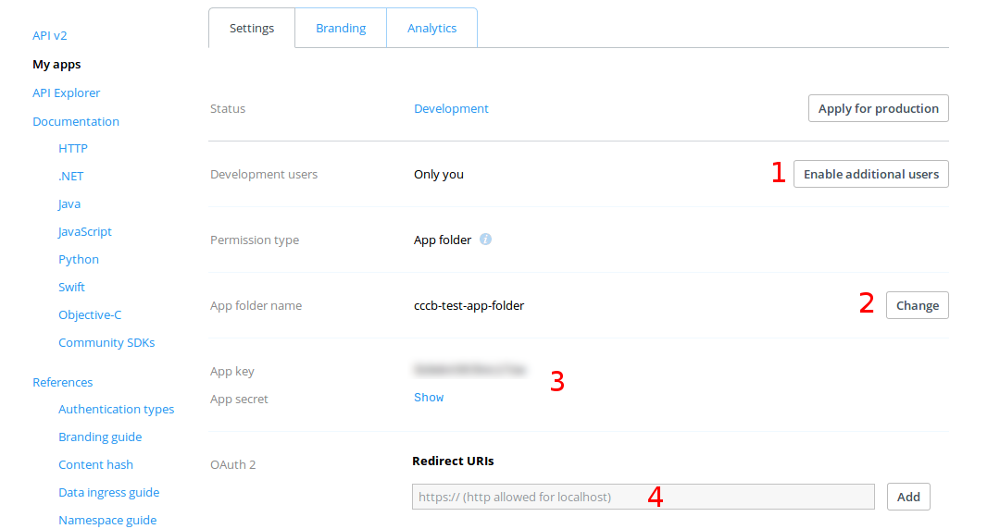

### This document describes setting up the transfer app on a new machine.

---

#### The  basics
First, you will need a domain to use.  For many providers, the OAuth2 authentication flow requires that the callback URL goes to a "real" domain, not a raw IP address.  Testing with localhost has not been performed.

Once you decide on a cloud provider (Google Cloud, AWS), you will need to create a new VM instance which will be the main host of the application.  Below, we have used a VM running Debian Linux; other Linux variants or non-Linux machines have *not* been tested. 

You will need to enable inbound traffic on ports 80 and 443.  In the nginx setup below, we automatically route all http traffic (port 80) to https (port 443).  

Finally, you will need to point your domain at this new machine.

---

#### Host machine setup
From a fresh Debian machine, we install nginx which will be our reverse proxy server.

```
apt-get update
apt-get install -y nginx
```
You can use any certificate authority you like, but we simply use the free SSL certificates provided by LetsEncrypt.  

Go to letsencrypt.org/ which ultimately sends us to https://certbot.eff.org/

For Debian (Stretch), it asks us to install certbot:
```
sudo apt-get install -y python-certbot-nginx -t stretch-backports
```
In the documentation (as of writing), the text explains that the automated process was temporarily disabled due to a potential security issue.  Thus, the process needs to be handled somewhat manually.

Just in case, stop nginx:
```
service nginx stop
```

Run (as root):
```
certbot certonly
```

At the time of writing, you are then presented with three options.  I chose option 2 ["Spin up a temporary webserver (standalone)"].  Then answer the prompts and it will print where the files went.  Files are placed in `/etc/letsencrypt/live/<YOUR DOMAIN>/`.


Now, open the nginx conf and enter:
```
server {
    listen 80 ;
    listen [::]:80 ;
    server_name <YOUR DOMAIN>;
    return 301 https://$server_name$request_uri;
}

server {

    server_name dev.tm4.org;

    listen [::]:443 ssl ipv6only=on;
    listen 443 ssl;

    ssl_certificate /etc/letsencrypt/live/<YOUR DOMAIN>/fullchain.pem;
    ssl_certificate_key /etc/letsencrypt/live/<YOUR DOMAIN>/privkey.pem;
    include /etc/letsencrypt/options-ssl-nginx.conf;
    ssl_dhparam /etc/letsencrypt/ssl-dhparams.pem;

    location / {
        include proxy_params;
        proxy_set_header X-Forwarded-Proto https;
        proxy_pass http://unix:/www/dev.sock;
    }
}
```
Change the domain above (`<YOUR DOMAIN>`) as appropriate.  Note that we specify that the nginx server will communicate with the backend application server (gunicorn) via a Unix socket at `/www/dev.sock`.  If there is not already a `/www` directory, create one (or modify the names to your preference).
 
If you visit the site, you should get a 502 bad gateway.  Now everything is setup on the host, but need to work on the app container.

---

### Register with storage providers


Instructions for these can potentially change over time, but in general each storage provider will require you to register as an application developer.  Instructions for Dropbox and Google Drive are provided below.

You need to choose at least one storage provider for the application to run.  In addition, we provide URLs to live-test both authentication and transfer functionality.  These will help to test that the proper credentials are in place for each provider.

**Dropbox**

You can register a new application with Dropbox at https://dropbox.com/developers/ .  There, you create an application by:

- Click on "My Apps" (left-hand menu)
- Click "Create app"
- Choose "Dropbox API"
- Choose "App folder", which gives the transfer application access to a single folder in a user's Dropbox.
- Create any name for your application.

After this, Dropbox will send you to a dashboard for your application, as shown below.  You may click on "Enable additional users" (1) to allow "public" access to the application.  You can change the name of the accessible folder in (2), and you need to add your callback URLs in (4).  

For dropbox, the callback URL in the source code is formatted like `https://<YOUR DOMAIN>/dropbox/callback/`, so you will substitute your domain and enter that value in the redirect URIs field (4).  For live-testing purposes, you will need to register two additional URLs, if you wish to use the live-test functionality.  These are:
- `https://<YOUR DOMAIN>/test/dropbox-callback` (for testing OAuth2 token exchange)
- `https://<YOUR DOMAIN>/test/transfer-test/dropbox-callback` (for performing an actual transfer)

Finally, you will need to keep track of your app key/secret pair.  When you start the Docker container that holds the application, a script will prompt you to enter these values, which will be placed into a configuration file.  



At the time of writing, application is placed in default "development" status.  This allows up to 500 unique users to connect to your application.  If you expect use beyond that, we encourage you to apply for production status, which typically involves creation of a test account so the Dropbox team can evaluate the application.

** Google Drive **

 To integrate with Google Drive, you need to obtain **two** types of  application credentials from Google.  One is for the OAuth2 authentication flow (allowing uploads to Google Drive) and the other is an API key used to identify your application when using Google's Picker API (which lets you use Google's own file browser for selecting files to transfer TO your application's bucket storage).
 
   Go to `https://console.developers.google.com` (or `https://console.cloud.google.com` if you are using Google Cloud as your cloud provider).
 
 If you are not using Google Cloud as your host (in which case you are likely already using `https://console.cloud.google.com`), this will require you to create a new "project" with google, at which point it will direct you to the developers dashboard, as pictured below:

![alt text] (google_dashboard.png)

 Using the menu on the top left, navigate to "APIs & Services" as shown below.

![alt text] (google_dashboard_1.png)
  
 First, you will need to enable access to the Google Drive API, which you do via the "API & Services --> Dashboard" page.  
 
 Following that, you will need to create OAuth credentials for your application.  This involves several steps not covered here (including application verification).  Since it is challenging to anticipate changes in procedure and steps, we advise searching for some phrase like, "obtain OAuth2 credentials Google Drive API".  

 The OAuth2 credentials you obtatin should be for a web application, which will require you to register the callbacks, similar to Dropbox above.  The Google Drive callback is:
 - `https://<YOUR DOMAIN>/drive/callback/`
 
 and for live-testing:
 - `https://<YOUR DOMAIN>/test/drive-callback/` (for testing OAuth2 token exchange)
 - `https://<YOUR DOMAIN>/drive/transfer-test/drive-callback/` (for live-testing an actual transfer)

 With these steps successfully completed, you will need to obtain the ID (typically `<random characters>.apps.googleusercontent.com`) and secret for the credentials.  You will eventually enter those at the prompt when starting the application container.
 
 For the second set of credentials (the API key), go to the "APIs & Servies" tab and click on "Create credentials", choosing "API key" this time (see fiigure below).  After these credentials are created, simply copy down the random string somewhere, for use when starting the application.  This string will be publicly available, so it is not a secret. 

![alt text] (api_keys.png)
---
### Application setup

The transfer application relies on a series of Docker containers, and we assume some familiarity with Docker.  

The primary container wraps the source code of the actual web application.  The application itself, in turn, relies on a number of "worker" Docker containers which perform the actual file transfers on ephemeral machines.  Those worker containers are specific to the cloud provider and the storage provider (e.g. transferring to Dropbox using AWS infrastructure).

One can either use the public images available at Dockerhub (`docker.io/blawney`) *or* build their own Docker images by cloning the repository and building from there.  The main application image can be built using the Dockerfile in `<repo directory>/docker_build/`, while the "worker" images are contained in various Dockerfiles under the `<repo directory>/startup_script/` directory.


If you choose to build your own Docker images, be sure to change the `docker_image` references in `config/downloaders.template.cfg` and `config/uploaders.template.cfg`, so the proper final configuration files are created upon application startup.

Below, we assume you are working from our pre-built image, or have built your own images.  Substitute the container references below (e.g. `docker.io/blawney/transfer_app`) as appropriate.

   

On your host VM setup earlier, pull the container image:

```
docker pull docker.io/blawney/transfer_app
```

Run the container:

```
docker run -it -v /www:/host_mount docker.io/blawney/transfer_app
```
Note the `-it` arg, which logs you into an interative terminal inside the container.  Also note the paths in the `-v` argument where we mount the `/www` directory in the container.  Above, in the nginx configuration, we specified that the application would be available from the `/www` directory via the unix socket at `/www/dev.sock`.  Hence, we make that directory available to the container.  Change this to match your nginx config as appropriate.

That command will start the container and you will be logged in as root in a bash shell.  Next, we need to run a startup script, which will prompt for some parameters to "inject" into various configuration files.  Run,

```
/opt/startup/startup_commands.sh
```
and answer the questions.  After a few moments, the application server (gunicorn)should be started and you can try out your live test.

If you are integrating email functionality (to allow notifications and password-resets), you will need to stop the application server with Ctrl+C.  Then, follow the instructions below (e.g. for incorporating Gmail) and restart the application server with

```
gunicorn cccb_transfer.wsgi:application --bind=unix:/host_mount/dev.sock
```


#### Additional notes and remarks:

**Asynchronous code**

Note that we use supervisor to manage processes such as redis and celery, which enable the asynchronous features of the web application.  If you make changes to any source code that will run asynchronously (mostly logic around launching file transfers), you need to stop/restart those processes to "register" your changes.  Otherwise, they will ignore the changes and run stale code.

You can stop those processes and restart by running:
```
supervisorctl stop all
supervisorctl remove transfer_celery_beat
supervisorctl remove transfer_celery_worker
supervisorctl remove redis
supervisorctl reread
supervisorctl restart
```

**Email functionality**

As part of the prompts during container startup, we ask if you would like to enable emailing.  This allows users to reset their own passwords if they forget, and also informs them of completed transfers.  Enabling email is not necessary.

If you wish to use the Gmail API to send your emails, we provide details below.  

If you plan to use a *different* email service, you will need to edit the application code accordingly.  The code responsible for sending email is contained in `<repository directory>/helpers/email_utils.py`.  If you keep the function signature the same, other parts of the application will be able to use your custom function with no further edits.


**Gmail integration:**

If you wish to use Gmail as your mail provider, the application is "ready", provided you format your Gmail credentials properly.  At this point, we assume you have already started the container and answered all the prompts, so the application is already online.  Enter your running container with `docker exec -it <container ID> /bin/bash` and stop the application server (gunicorn).  

Next, on your own machine, go to the Google developers console (`https://console.developers.google.com` or `https://console.cloud.google.com`) and head to "APIs & Services" and "Dashboard".  Click on "Enable APIs and Services", search for "Gmail" and enable the Gmail API. 

Once that is enabled, go to the "Credentials" section under "APIs and Services".  Just as above, we will create a set of OAuth credentials.  Click on the "Create credentials" button and choose "OAuth Client ID".   Choose "Other" from the options and give these credentials a name.

Once the credentials are created, download the JSON-format file.  Open that file, copy the contents, and paste the text into a *new* file **in your container**  and save it somewhere memorable (e.g. `/www/original_gmail_credentials.json`).

Also inside that container, start a python3 terminal (simply type `python3` in the shell), and enter the following, substituting the path to your credentials:

```python
>>> from google_auth_oauthlib.flow import InstalledAppFlow
>>> scopes = ['https://mail.google.com/']
>>> f = '/www/original_gmail_credentials.json'
>>> flow = InstalledAppFlow.from_client_secrets_file(f, scopes)
>>> creds = flow.run_console()
```

At this point, the console will print a long URL with instructions to put that into a web browser.  Copy and paste that link into a browser on your **local machine**.  You will be asked to log into your Google account and give approval to use the Gmail API.  Of course, you need to use the Gmail account from which you wish to send email.  If all goes successfully, you will be provided a "code", which you will enter into the python terminal back **in the container**.  Following that, your python terminal will have a `creds` object with all the necessary credentials for using the Gmail API.  

Now we just need to save those credentials to a file which the application will read when it needs to send email.  Again, in your running python3 terminal (in the container):
```python
>>> import json
>>> d = {}
>>> d['refresh_token'] = creds.refresh_token
>>> d['token'] = creds.token
>>> d['token_uri'] = creds.token_uri
>>> d['client_id'] = creds.client_id
>>> d['client_secret'] = creds.client_secret
>>> d['scopes'] = creds.scopes
>>> f = open('/www/final_gmail_credentials.json', 'w')
>>> json.dump(d, f)
```

Change the path to the "final" credentials file accordingly.  Now, open your `settings.py` file and find the `EMAIL_CREDENTIALS_FILE` varible, which is (by default) an empty string.  Enter the path there, e.g.
```python
EMAIL_CREDENTIALS_FILE = '/www/final_gmail_credentials.json'
```

You can also double-check that the `EMAIL_ENABLED` variable is set to `True`.  Your Gmail integration is now complete!  
